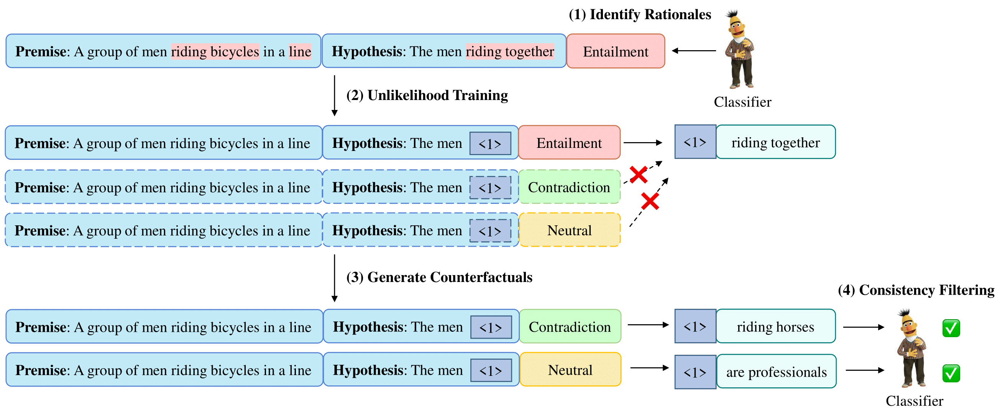

# AutoCAD

Code and datasets for our paper ["AutoCAD: Automatically Generating Counterfactuals for Mitigating Shortcut Learning"](https://arxiv.org/pdf/2211.16202.pdf)

### Updates

**[Oct 13 2022]** Code released

### 1. Environment Setup

- python >= 3.8
- `pip install -r requirements.txt`

### 2. Data Preprocessing

- Run `unzip data.zip`

### 3. Run the Code

Before running the code, please change the `WORKING_DIR` in the script according to your own path.

#### (1) Train a Classifier

`bash scripts/train.sh`

#### (2) Identify Rationales

- get gradient-based saliency scores: `bash scripts/saliency.sh`

- get rationale-corrupted data: `python tools/highlight.py`

#### (3) Train a Counterfactual Generator

- train a counterfactual generator on the rationale-corrupted data: `bash scripts/train_generator.sh`

#### (4) Generate Counterfactuals

- generate counterfactuals on the label-flipped rationale-corrupted data: `bash scripts/generate.sh`

#### (5) Consistency Filtering

- predict the label of the generated counterfactuals with the fine-tuned classifier: `bash scripts/predict.sh`
